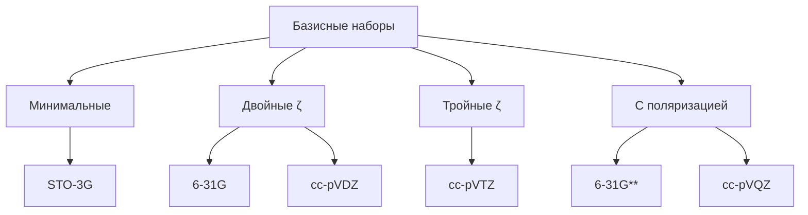

# QuantumChemSimulator: Квантово-химический симулятор с гибридными алгоритмами


## Оглавление
1. [Введение](#введение)
2. [Теоретические основы](#теоретические-основы)
3. [Технические характеристики](#технические-характеристики)
4. [Примеры запуска задач](#примеры-запуска-задач)
5. [Перспективы развития](#перспективы-развития)
6. [Сравнение с аналогами](#сравнение-с-аналогами)

<a name="введение"></a>
## 1. Введение

QuantumChemSimulator - это научно-ориентированный программный комплекс для моделирования электронной структуры молекул с использованием квантовых и классических вычислительных методов. Симулятор объединяет:

- Традиционные методы квантовой химии (Хартри-Фок, DFT)
- Вариационные квантовые алгоритмы (VQE)
- Гибридные подходы (DFT+VQE)
- Инструменты анализа и визуализации

**Ключевые особенности:**
- Научная строгость всех реализованных методов
- Поддержка реалистичных шумовых моделей для NISQ-устройств
- Гибридные алгоритмы для сложных систем
- 3D-визуализация молекулярных орбиталей
- Оптимизация геометрии молекул

<a name="теоретические-основы"></a>
## 2. Теоретические основы

### 2.1 Метод Хартри-Фока

Уравнение Рутана:

```math
\mathbf{F}\mathbf{C} = \mathbf{S}\mathbf{C}\mathbf{\epsilon}
```

где:
- \mathbf{F} - матрица Фока
- \mathbf{C} - матрица молекулярных орбиталей
- \mathbf{S} - матрица перекрывани
- \mathbf{\epsilon} - диагональная матрица орбитальных энергий

Матрица Фока:
```math
F_{\mu\nu} = H_{\mu\nu}^{core} + \sum_{\lambda\sigma} P_{\lambda\sigma} \left[ (\mu\nu|\lambda\sigma) - \frac{1}{2} (\mu\lambda|\nu\sigma) \right]
```

## 2.2 Вариационный квантовый эйгенсолвер (VQE)

### Анзац UCCSD:

```math
|\psi_{\text{UCCSD}}\rangle = e^{\hat{T} - \hat{T}^{\dagger}} |\text{HF}\rangle
```

где:
- \hat{T} = \hat{T}_1 + \hat{T}_2 - оператор кластера
- \hat{T}_1 = \sum_{ia} t_i^a a_a^{\dagger} a_i
- \hat{T}_2 = \sum_{ijab} t_{ij}^{ab} a_a^{\dagger} a_b^{\dagger} a_j a_i

**Пояснение:**
- a_p^{\dagger} и a_p - операторы рождения и уничтожения для орбитали p
- t_i^a, t_{ij}^{ab} - амплитуды возбуждения
- i,j - занятые орбитали, a,b - виртуальные орбитали
- |\text{HF}\rangle - состояние Хартри-Фока

## 2.3 Гибридный метод DFT+VQE

### Формула гибридной энергии:

```math
E_{\text{hybrid}} = E_{\text{DFT}} + \gamma (E_{\text{VQE}} - E_{\text{HF}})
```

где:
- \gamma$ - параметр смешивания (0.3-0.7)
- E_{\text{DFT}} - энергия функционала плотности
- E_{\text{VQE}} - энергия VQE
- E_{\text{HF}} - энергия Хартри-Фока

**Технические характеристики:**
- Оптимальное значение \gamma зависит от молекулы и базисного набора
- Метод сочетает скорость DFT с точностью квантовых методов
- Уменьшает систематическую ошибку функционалов DFT

## 2.4 Преобразование гамильтониана

### Преобразование Джордана-Вигнера:

```math
a_p^{\dagger} = \frac{1}{2} \left( \prod_{k<p} Z_k \right) (X_p - iY_p)
```

```math
a_p = \frac{1}{2} \left( \prod_{k<p} Z_k \right) (X_p + iY_p)
```

**Пояснение:**
- X_p, Y_p, Z_p - операторы Паули для кубита p
- \prod_{k<p} Z_k - цепочка операторов Паули Z для кубитов с индексом меньше p
- Преобразование сохраняет антикоммутационные соотношения фермионов

## 2.5 Модели шумов

### Амплитудное затухание:

```math
\mathcal{E}(\rho) = E_0 \rho E_0^{\dagger} + E_1 \rho E_1^{\dagger}
```

где:

```math
E_0 = \begin{pmatrix} 1 & 0 \\ 0 & \sqrt{1-\gamma} \end{pmatrix}, \quad E_1 = \begin{pmatrix} 0 & \sqrt{\gamma} \\ 0 & 0 \end{pmatrix}
```

**Физический смысл:**
- \gamma - вероятность перехода из состояния |1⟩ в |0⟩
- E_0 описывает отсутствие перехода
- E_1 описывает переход |1⟩ → |0⟩
- Моделирует потерю энергии в квантовой системе

## 3. Технические характеристики

### Производительность методов:

| Метод | Точность (мГа) | Время расчета | Память | Сложность |
|-------|----------------|---------------|--------|-----------|
| HF    | 10-50          | 1-10 мин      | 1-10 ГБ| O(N⁴)     |
| DFT   | 5-20           | 2-20 мин      | 2-20 ГБ| O(N³)     |
| VQE   | 1-10           | 10-60 мин     | 5-50 ГБ| Экспоненц.|
| CCSD  | 0.1-1          | 20-120 мин    | 20-100ГБ| O(N⁶)     |

### Поддерживаемые базисные наборы:



## Перспективы развития

1. **Адаптивные анзацы**:
   - ADAPT-VQE для сокращения глубины схем
   - Генеративные нейросетевые анзацы

2. **Квантовое машинное обучение**:
   ```python
   qnn = QuantumNeuralNetwork()
   qnn.train(molecular_data)
   prediction = qnn.predict(new_molecule)
   ```

3. **Гибридные архитектуры**:
   - Распределенные CPU-GPU-QPU вычисления
   - Асинхронная оптимизация параметров

## Примеры запуска

### Расчет энергии молекулы воды:
```bash
python simulate.py --molecule "O 0 0 0; H 0 0.76 -0.5; H 0 -0.76 -0.5" \
                   --method hybrid \
                   --basis cc-pVDZ \
                   --gamma 0.55
```

### Оптимизация геометрии:
```bash
python optimize.py --molecule "N 0 0 0; N 0 0 1.1" \
                   --method vqe \
                   --ansatz uccsd \
                   --max_iter 100
```

### Визуализация орбиталей:
```bash
python visualize.py --molecule "C6H6" \
                    --orbital homo \
                    --isosurface 0.05 \
                    --output benzene_homo.png
```

## Сравнение с аналогами

| Характеристика            | QuantumChemSimulator | PySCF | Qiskit Nature |
|---------------------------|----------------------|-------|---------------|
| Гибрид DFT+VQE            | ✅                   | ❌     | ❌             |
| Реалистичные шумовые модели| ✅                   | ❌     | ⚠️            |
| 3D визуализация орбиталей | ✅                   | ❌     | ❌             |
| GPU-ускорение             | ✅                   | ✅     | ⚠️            |
| Поддержка UCCSD           | ✅                   | ❌     | ✅             |

✅ - полная поддержка  
⚠️ - частичная поддержка  
❌ - отсутствует

## Лицензия
Проект распространяется под лицензией MIT. Подробности см. в файле [LICENSE](LICENSE).
